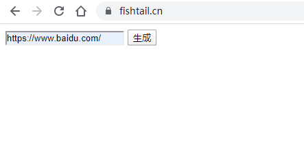
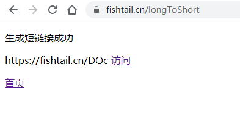

# shortUrl
## 用laravel实现的一个短链接系统


1. 在网站根目录的终端执行

`git clone https://github.com/fishtailstudio/shortUrl.git`

2. 创建数据库，并执行/sql/short_url.sql

3. 修改/scr/.env中数据库配置
```nginx
DB_CONNECTION=mysql
DB_HOST=127.0.0.1
DB_PORT=3306
DB_DATABASE=short_url
DB_USERNAME=root
DB_PASSWORD=123456
```

3. 修改Nginx.conf（[官方文档](https://learnku.com/docs/laravel/6.x/installation/5124#37e654)）
```nginx
location / {
    try_files $uri $uri/ /index.php?$query_string;
}
```
并且修改
```nginx
root   "D:/phpstudy_pro/WWW/shortUrl/src/public";
```

4. 访问`http://localhost/`。


首页：





生成短链接：


